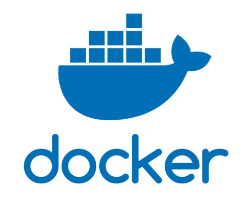
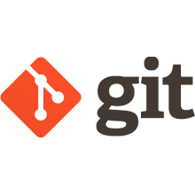

# TIBET&#8482; -- The future is written in markup&#8482;


                                     ,`
                              __,~//`
           ,///,_       .~///////'`
               '//,   ///'`
                  '/_/'
                    `
            /////////////////     /////////////// ///
            `//'````````///      `//'```````````  '''
            ,/`          //      ,/'
           ,/___          /'    ,/_____
          ///////;;,_     //   ,/////////;,_
                   `'//,  '/            `'///,_
                       `'/,/                '//,
                          `/,                  `/,
                            '                   `/
                                                 '/
                                                  /
                                                  '

<br/>


###### For full TIBET documentation see the <a href="https://github.com/TechnicalPursuit/TIBET">README</a> and <a href="https://www.technicalpursuit.com/docs/">https://technicalpursuit.com</a>.

<br/>

---

<br/>


# Installation

Before you install TIBET we recommend you check our <a href="#supported">supported platform chart</a> for your platforms/browsers. Microsoft Windows users may need to use Docker, for example.

There are a number of ways to install TIBET...

If you're doing Node/JS development on Mac or Linux <a href="#npminstall">install TIBET via `npm`</a>.

See <a href="#dockerinstall">installing via Docker</a> to use one of our <a href="https://hub.docker.com/r/technicalpursuit/tibet">pre-built TIBET Docker images</a>.

To install a Git fork on Mac/Linux see the <a href="#gitinstall">TIBET Git Installation</a> instructions.

<br/>

---


<a name="npminstall" href="#"></a>
### Installing TIBET via npm:

If you are missing any of TIBET's node/npm <a href="#installprereqs">prerequisites</a> install those by following the instructions in the <a href="#installprereqs">prerequisites section</a> of this guide.

TIBET is currently installed globally using `npm install -g`:
<br/>

    npm install -g tibet

<i>NOTE: Future versions will install the TIBET CLI globally and install the
library locally.</i>

Initial installation can take several minutes depending on the speed of
your network connection and the particular version being installed. Be patient
:).

Due to limitations in `npm`, complete the installation by running the following command to install TIBET's `devDependencies` in the newly-installed TIBET global package:

    $(npm root -g)/tibet/bin/tibet_develop_init.bash

**Once your installation completes check out the <a href="https://www.technicalpursuit.com/docs/quickstart.html">TIBET Quickstart Guide</a>.**

<br/>

---



<a name="dockerinstall" href="#"></a>
### Installing TIBET via Docker:

TIBET Docker images exist on DockerHub and are prebuilt for ease of development.

###### Ensure you have Docker installed

To get started with TIBET and Docker you'll need Docker software for your machine.

To install Docker follow the install instructions found in the <a href="https://docs.docker.com">Docker Documentation</a>.

###### Install a TIBET Docker image

Next, install the TIBET Docker image by pulling it from Dockerhub:

    docker pull technicalpursuit/tibet

The above command will pull the latest TIBET release (by default `docker pull` will pull the image with the `:latest` tag). The following command is equivalent:

    docker pull technicalpursuit/tibet:latest

TIBET follows a 'semver' versioning scheme which allows you to pull specific versions using commands similar to the following:

    docker pull technicalpursuit/tibet:5

    docker pull technicalpursuit/tibet:5.0

    docker pull technicalpursuit/tibet:5.0.0

##### Instantiate a TIBET-imaged container

Create a Docker container and execute it by running the TIBET Docker image.

Note that port 1407 (the registered TIBET Data Server port) is exposed inside the container by default. To execute the environment and expose the port into your host environment, execute the following:

    docker run -i -p 127.0.0.1:1407:1407/tcp -t technicalpursuit/tibet

You are now inside of the Docker environment, inside of the home directory of
the 'developer' user that the TIBET Docker image created for you, ready to start
TIBET development!

After you create your TIBET project and build it (see instructions later on how
to do that), you can access the TIBET Data Server running in your Docker
container by going to this address in a browser in your host environment:

    http://127.0.0.01:1407

***NOTE*** Be aware that Docker does **NOT** preserve the environment after you
exit the container (by executing `exit` from the shell). Any work you've done in
the container will be lost!!! Therefore, you need to use Docker to either mount
a volume or use bind mounts to persist your TIBET project. Follow the
instructions at <a href="https://docs.docker.com/storage/volumes/">Docker Volumes</a> and <a href="https://docs.docker.com/storage/bind-mounts/">Docker Bind Mounts</a>.

<br/>

---



<a name="gitinstall" href="#"></a>
### Installing TIBET via Git:

If you prefer working from a git repository you can install TIBET via git. This
approach can take a fair amount of time depending on connection and machine
speed since you'll need to download all of TIBET's dependencies and build them
locally.

Check TIBET's <a href="#installprereqs">prerequisites</a> first.

Next, check TIBET's <a href="#supported">supported platform chart</a> for your target platform(s).

NOTE: Be sure to uninstall any npm-installed version of TIBET. If you have already installed TIBET via npm you need to first remove that installation to avoid conflicts with your Git-based installation:

    npm uninstall -g tibet

##### Create a Fork

If you are going to install TIBET via Git we recommend that you first create a
fork of TIBET so you can manage updates in a stable, predictable fashion.

Follow these instructions to <a href="https://help.github.com/articles/fork-a-repo/">create
your own fork</a>.

##### Clone your Fork

    git clone {{your_fork_repo_url}}

##### Initialize your Fork

Once your fork has been cloned move into the new fork directory and install the
package dependencies:

    cd {{your_fork_repo_directory}}
    npm install .

##### Link TIBET via npm

With your fork initialized you'll need to link the repository via `npm link` so
that the `tibet` command will function. From the top of your TIBET fork type:

    npm link .

<br/>
You should now be able to use the `tibet` command which lets you run `tibet
build`.

##### Build TIBET Dependencies and Packages

When working with a `git`-based repository you'll need to rebuild TIBET packages
and dependencies, depending on your individual project launch configuration.

To build the full set of TIBET dependencies and launch packages use:

    tibet build_all

NOTE: the above command can take _quite some time_ depending on your network
connection, machine performance, etc. since it's building a large set of
dependent modules in addition to TIBET itself.

With TIBET cloned, initialized, linked, and built you're ready to rock.

<br/>

---

<a name="supported" href="#"></a>
# Supported Platforms

###### TIBET CLI / Server

The TIBET CLI, TIBET Data Server (TDS), TIBET Workflow System (TWS) and other server-side
components are **fully-supported on MacOS and common Linux variants**.

For Microsoft Windows we recommend using Docker or similar container technology. Pre-built <a href="https://hub.docker.com/r/technicalpursuit/tibet">Docker images are available</a>. Native Windows support is being considered but has no release date planned. <a href="http://www.technicalpursuit.com/contact.xhtml">Contact us</a> if you require native Windows TDS, TWS, or CLI components.


###### TIBET Client / Sherpa

| Platform | TIBET Client Runtime | TIBET Live Patching | TIBET Sherpa |
|:---------|:----------------------|:--------------------|:-------------|
| Google Chrome | Yes | Yes | Yes |
| Mozilla Firefox | Yes | Yes | No |
| Apple Safari | Yes | Yes | No |
| Electron | Yes | Coming Soon | Coming Soon |
| Microsoft Edge (Chromium) | Coming Soon | Coming Soon | Coming Soon |
| Microsoft Edge (EdgeHTML) | No | No | No |
| Microsoft IE | No | No | No |

<br/>

---


<a name="installprereqs" href="#"></a>
# Prerequisites

#### Install Node.js

TIBET requires Node.js version 10+ for proper operation.

We also recommend using `npm` version `6.x` or higher.

You can confirm your node, and npm versions using:

    node --version
    v10.16.3

    npm --version
    6.9.0

**We strongly recommend you use the Node Version Manager (`nvm`)** to manage
your Node.js installation. Using `nvm` lets you install multiple versions of
Node.js and switch between them with ease which is great for development and
helpful if you need to adjust the version running in production while
maintaining an easy rollback strategy.

To install Node.js via `nvm` see the instructions at <a
href="https://github.com/creationix/nvm">the nvm GitHub repo</a>.

To install Node.js without `nvm` follow the instructions at <a href="http://nodejs.org">nodejs.org</a>.

#### Update/Adjust npm

If you already have a recent version of Node.js installed you should have a
valid version of `npm`. We suggest using at least npm `5.x`.

If you see errors from any npm-based operations mentioning `cb() never called!`
you'll want to perform the appropriate steps for your
operating system. See <a
href="https://github.com/npm/npm/wiki/Troubleshooting#try-the-latest-stable-version-of-npm">this npm troubleshooting topic</a> for more.

<br/>

---


<a href="https://www.technicalpursuit.com/contact.xhtml">Contact us</a> for more information, or to discuss how we can assist you.
